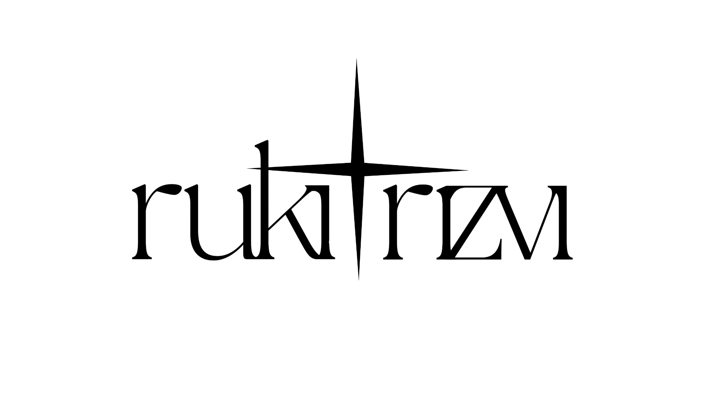

# Rukizm Art Portfolio

A clean, responsive portfolio website for showcasing digital artwork and illustrations.



## Features

- Responsive gallery layout that preserves artwork aspect ratios
- Lightbox modal for enlarged image viewing
- Smooth transitions and animations
- Mobile-friendly navigation
- Simple about page with contact form
- Clean minimal design focused on showcasing the artwork

## Live Demo

[Visit the live website](#) <!-- Replace with your actual website URL once deployed -->

## Project Structure

```
rukizm-portfolio/
│
├── css/
│   └── style.css          # Main stylesheet
│
├── js/
│   └── script.js          # Main JavaScript file
│
├── images/
│   ├── logo.png           # Site logo
│   └── [...artwork files] # Gallery images
│
└── index.html             # Main HTML file
```

## Setup and Deployment

### Local Development

1. Clone this repository:
   ```
   git clone https://github.com/yourusername/rukizm-portfolio.git
   ```

2. Open `index.html` in your browser to view the site locally

### Deployment

This is a static website that can be deployed to any web hosting service:

- **GitHub Pages**: Enable in repository settings
- **Netlify**: Connect your GitHub repository or drag-and-drop the folder
- **Vercel**: Import your GitHub repository
- **Traditional hosting**: Upload files via FTP to your hosting provider

## Contact Form Setup

The contact form requires a backend service to function. The easiest solution is to use [Formspree](https://formspree.io/):

1. Create a free Formspree account
2. Get your unique form endpoint
3. Update the form action in `index.html`:
   ```html
   <form id="contactForm" action="https://formspree.io/f/YOUR_FORMSPREE_ID" method="POST">
   ```

## Customization

### Adding New Artwork

1. Add your image files to the `images/` directory
2. Update the gallery in `index.html` by adding new gallery items following the existing pattern:
   ```html
   <div class="gallery-item">
       
   </div>
   ```

### Changing Colors and Styling

Edit the CSS variables and styles in `css/style.css` to match your branding.

### Updating Content

- Update the "About Me" section in `index.html` to personalize your bio
- Replace the logo in the `images/` directory

## Browser Support

- Chrome (latest)
- Firefox (latest)
- Safari (latest)
- Edge (latest)

## License

This project is licensed under the MIT License - see the LICENSE file for details.

## Credits

- Artwork © Rukizm
- Website design and development by [Your Name]
